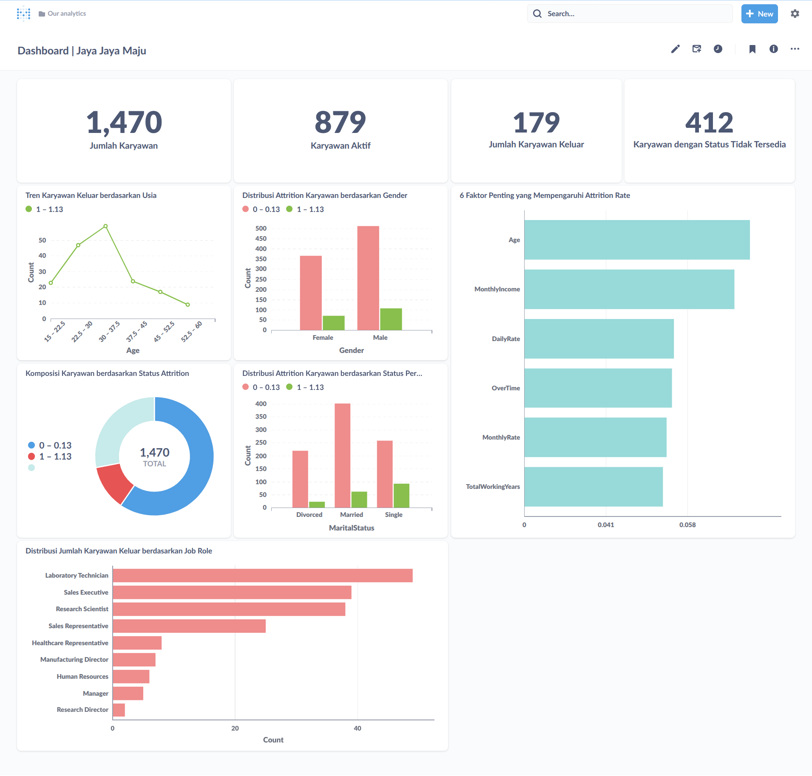

# Proyek Akhir: Menyelesaikan Permasalahan Perusahaan Edutech

## Business Understanding

Jaya Jaya Maju merupakan salah satu perusahaan multinasional yang telah berdiri sejak tahun 2000. Ia memiliki lebih dari
1000 karyawan yang tersebar di seluruh penjuru negeri.

Walaupun telah menjadi menjadi perusahaan yang cukup besar, Jaya Jaya Maju masih cukup kesulitan dalam mengelola
karyawan. Hal ini berimbas tingginya attrition rate (rasio jumlah karyawan yang keluar dengan total karyawan
keseluruhan) hingga lebih dari 10%.

Untuk mencegah hal ini menjadi semakin parah, manager deparetemen HR ingin melakukan identfikasi faktor yang
mempengaruhi tingginya attrition rate dan membuat business dashboard untuk memonitori berbagai faktor tersebut.

### Permasalahan Bisnis

Terdapat beberapa permasalahan bisnis yang terjadi pada perusahan Jaya Jaya Maju berdasarkan latar belakang perusahan di
antaranya adalah:

- Faktor apa saja yang dapat mempengaruhi seorang karyawan keluar dari perusahaan Jaya Jaya Maju?
- Bagaimana cara mengidentifikasi seorang karyawan apakah dia berpotensi untuk keluar dari perusahaan dengan cepat dan
  efektif?
- Bagaimana membangun business dashboard yang dapat membantu manajer departemen HR untuk melakukan montoring faktor yang
  mempengaruhi tingginya attrition rate karyawan?

### Cakupan Proyek

Untuk menyelesaikan permasalahan di perusahaan Jaya Jaya Maju mengenai tingginya attrition rate adalah dengan membuat
model machine learning yang mampu memprediksi apakah karyawan tersebut berpotensi keluar dari perusahaan dengan melihat
faktor-faktor yang ada.

Untuk melihat faktor-faktor yang paling mempengaruhi tingginya attrition rate dapat melakukan Exploratory Data Analysis
untuk memperolah gambaran terkait dataset yang digunakan. Selain itu, juga menerapakan metode Embedded untuk mendapatkan
faktor-faktor yang paling berpengaruh. Jadi, model yang dibuat dapat memprediksi dengan baik dan diharapkan dapat
mengatasi permasalahan perusahaan.

Berdasarkan cakupan proyek ini, dibutuhkan beberapa resource dan tool, yaitu

- Dataset yang berisi demografi karyawan serta metrik terkait pekerjaan
- Bahasa pemrograman python dan library seperti pandas, scikit-learn, matplotlib, seaborn untuk membangun model Machine
  Learning

### Persiapan

Sumber data: Pada proyek ini digunakan dataset dari tautan
berikut: [Jaya Jaya Maju](https://github.com/dicodingacademy/dicoding_dataset/tree/main/employee)

Setup environment:

#### 1. Prasyarat (Prerequisites)

Pastikan perangkat Anda telah memenuhi prasyarat berikut sebelum memulai:

- **Python**: Versi 3.12 atau yang lebih baru.
- **Docker**: Terinstal dan berjalan di sistem Anda. Docker diperlukan untuk menjalankan dashboard Metabase.

---

#### 2. Instalasi Lingkungan Kerja

Ikuti langkah-langkah berikut untuk menyiapkan lingkungan dan menginstal semua library yang dibutuhkan.

**Clone Repositori**

Buka terminal atau command prompt, lalu clone repositori ini ke dalam direktori lokal Anda.

```bash
git clone [URL_REPOSITORY_ANDA]
cd [NAMA_FOLDER_PROYEK]
```

**Instal Library**

Proyek ini menggunakan beberapa library Python yang tercantum dalam berkas `requirements.txt`. Jalankan perintah berikut
untuk menginstalnya:

```bash
pip install -r requirements.txt
```

Perintah ini akan secara otomatis menginstal `scikit-learn`, `joblib`, `pandas`, `numpy`, `matplotlib`, dan `seaborn`
dengan versi yang sesuai.

---

#### 3. Menjalankan Analisis & Pemodelan

Berkas `notebook.ipynb` berisi seluruh proses analisis, mulai dari eksplorasi data (EDA), pra-pemrosesan, pemodelan,
hingga evaluasi.

Anda dapat membuka dan menjalankan berkas ini menggunakan salah satu platform berikut:

- **Google Colab**: Unggah berkas `notebook.ipynb` ke Google Colab dan jalankan sel-selnya secara berurutan.
- **Kaggle Notebook**: Buat notebook baru di Kaggle dan unggah berkas `notebook.ipynb`.
- **Lingkungan Lokal (PyCharm, VS Code)**: Buka folder proyek di IDE Anda dan jalankan notebook melalui ekstensi Jupyter
  yang terintegrasi.

---

#### 4. Melakukan Prediksi

Skrip `prediction.py` dirancang untuk melakukan inferensi atau prediksi pada data baru menggunakan model yang telah
dilatih.

**Cara Menjalankan:**

1. Pastikan Anda berada di direktori utama proyek.
2. Pastikan folder `/model` yang berisi berkas `.joblib` (model, encoder, scaler) tersedia.
3. Jalankan skrip melalui terminal:

```bash
python prediction.py
```

Skrip ini akan memuat data input, melakukan proses encoding dan scaling yang sama seperti saat training, lalu memberikan
hasil prediksi dari model.

---

#### 5. Menjalankan Dashboard Metabase

Dashboard interaktif untuk proyek ini dibuat menggunakan **Metabase** dan dijalankan melalui **Docker**. Ikuti
langkah-langkah berikut untuk mengaksesnya:

**Tarik (Pull) Image Metabase dari Docker Hub**

Buka terminal Anda dan jalankan perintah berikut untuk mengunduh image Metabase versi terbaru.

```bash
docker pull metabase/metabase:latest
```

**Jalankan Container Metabase**

Setelah proses unduh selesai, jalankan container menggunakan perintah di bawah ini. Perintah ini akan menjalankan
Metabase di latar belakang dan memetakannya ke port 3000 di komputer Anda.

```bash
docker run -d -p 3000:3000 --name metabase metabase/metabase:latest
```

**Akses Metabase di Browser**

Buka browser favorit Anda dan kunjungi alamat berikut:

```
http://localhost:3000
```

**Lakukan Setup Awal dan Login**

Saat pertama kali mengakses, Anda akan disambut oleh halaman setup Metabase.

Ikuti prosesnya dan ketika diminta untuk membuat akun admin, isikan kredensial berikut:

- **Email**: `root@mail.com`
- **Password**: `root123`

Selesaikan langkah-langkah setup lainnya. Setelah itu, Anda akan diarahkan ke halaman utama Metabase.

**Hubungkan ke Database dan Akses Dashboard**

Setelah berhasil login:

1. Hubungkan Metabase ke sumber data (misalnya PostgreSQL atau MySQL) tempat data proyek ini disimpan.
2. Setelah koneksi berhasil, Anda dapat menemukan dan mengakses dashboard yang telah dibuat untuk proyek ini.

## Business Dashboard

Berikut ini adalah business dashboard yang telah dibuat pada proyek ini untuk membantu manager deparetemen HR untuk
melakukan monitoring faktor yang mempengaruhi Attrition Rate.



Dashboard "Jaya Jaya Maju" ini menyajikan gambaran analitik yang komprehensif mengenai dinamika karyawan dan
faktor-faktor yang memengaruhi attrition atau tingkat keluar karyawan.

Di bagian paling atas, terdapat kartu-kartu
metrik kunci yang secara ringkas menunjukkan total 1,470 karyawan, dengan 879 di antaranya berstatus aktif, 179 karyawan
telah keluar, dan 412 karyawan lainnya berada dalam status tidak tersedia, memberikan sekilas informasi penting mengenai
jumlah dan status karyawan.

**Tren Karyawan Keluar Berdasarkan Usia**

Grafik tersebut menunjukkan pola attrition seiring bertambahnya usia, dengan puncaknya terlihat
pada kelompok usia 30 hingga 37.5 tahun.

**Distribusi Attrition Karyawan Berdasarkan Gender**

Grafik tersebut menunjukkan jumlah karyawan yang keluar berdasarkan jenis kelamin, di
mana visualisasi ini mengindikasikan adanya jumlah keluar yang lebih dominan pada karyawan pria dibandingkan wanita.

**6 Faktor Penting yang Mempengaruhi Attrition Rate**

Grafik tersebut menunjukkan hasil analisis feature importance dari model prediktif,
terlihat bahwa Age, MonthlyIncome, DailyRate, OverTime, MonthlyRate dan TotalWorkingYears merupakan faktor-faktor paling
yang memengaruhi keputusan karyawan untuk meninggalkan perusahaan. Enam faktor ini didapatkan dari hasil pencarian fitur
penting menggunakan metode Embedded dengan model Random Forest.

**Komposisi Karyawan Berdasarkan Status Attrition**

Grafik tersebut menampilkan proporsi karyawan yang tetap bertahan lebih besar dibandingkan dengan yang keluar dari total
populasi.

**Distribusi Attrition Karyawan berdasarkan Status Pernikahan**

Grafik ini menunjukkan mengenai bagaimana tingkat keluar karyawan terdistribusi di antara status pernikahan yang
berbeda (cerai, menikah, lajang)

**Distribusi Jumlah Karyawan Keluar berdasarkan Job Role**

Grafik tersebut menunjukkan peran-peran pekerjaan mana yang mengalami jumlah keluar karyawan terbanyak, di mana "
Laboratory Technician" memiliki angka attrition tertinggi.

## Conclusion

Jelaskan konklusi dari proyek yang dikerjakan.

### Rekomendasi Action Items (Optional)

Berikan beberapa rekomendasi action items yang harus dilakukan perusahaan guna menyelesaikan permasalahan atau mencapai
target mereka.

- action item 1
- action item 2
